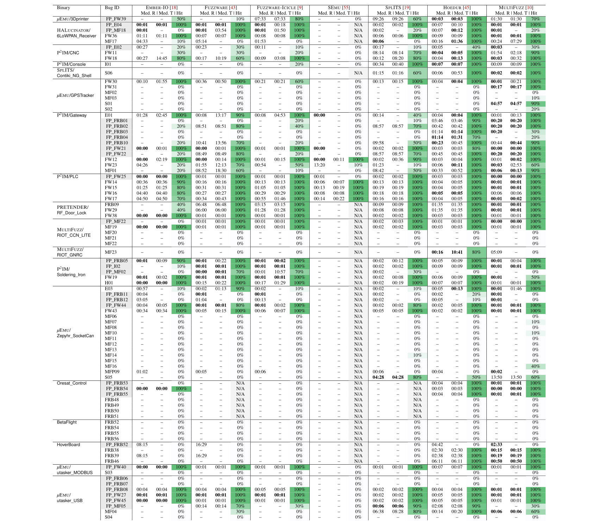
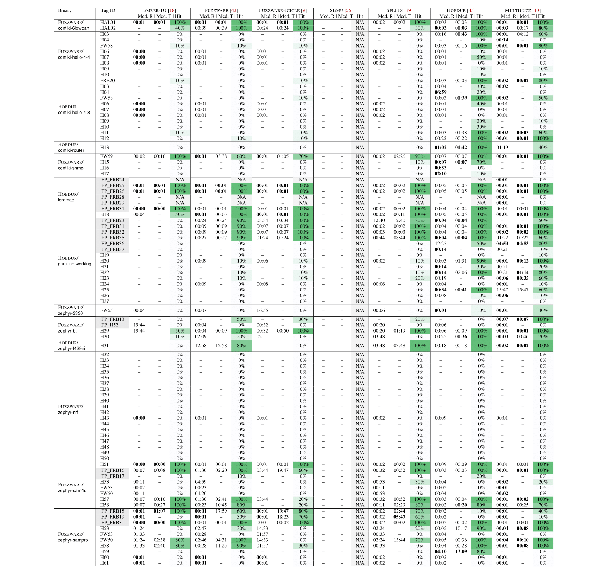
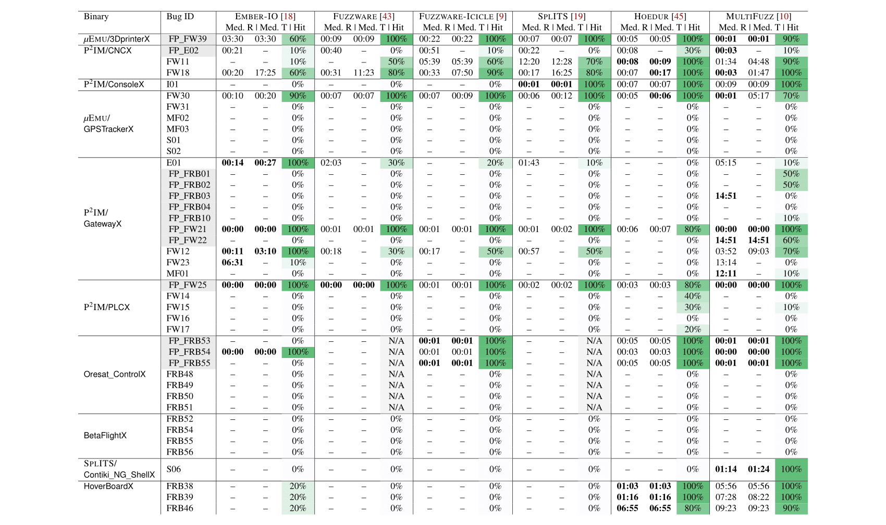
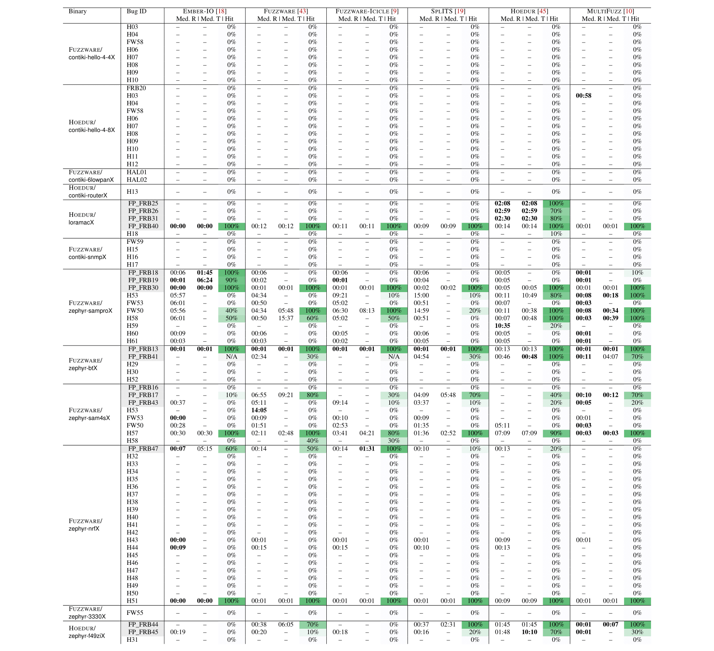

# FirmReBugger

## Raven Creation

We have made the process of incorporating a bug with a Raven, simple—we demonstrate the ease with which Ravens can be constructed using three case examples of common bug types:

- Type Confusion
- Stack Buffer Overflow
- Dangling Pointer

The examples can be seen [here](#raven-examples)


## Quick Start 

### Set up
```bash
echo core | sudo tee /proc/sys/kernel/core_pattern
sudo sh -c 'echo 524288 > /proc/sys/fs/inotify/max_user_watches && echo 512 > /proc/sys/fs/inotify/max_user_instances'
```

### Requirements

```bash
Install uv https://docs.astral.sh/uv/getting-started/installation/
Install docker https://docs.docker.com/engine/install 
sudo apt-get install automake texinfo unzip
sudo apt install gcc-arm-none-eabi
sudo apt install texlive-latex-base
sudo apt install texlive-xetex texlive-fonts-recommended texlive-latex-extra
```

### Build all Fuzzers 

```bash
git clone https://github.com/FirmReBugger/FirmReBugger
cd FirmReBugger
export FIRMREBUGGER_BASE_DIR=$(pwd)
# Follow the steps and build all fuzzers
uv run frb build
# Follow the steps and build all frb versions of fuzzers
uv run frb build --frb
```

### Fuzzing

```bash
git clone https://github.com/FirmReBugger/FirmReBugger
cd FirmReBugger
export FIRMREBUGGER_BASE_DIR=$(pwd)
uv run frb fuzz 24h 10 <output_dir>
```

### Commands

```bash
cd FirmReBugger
export FIRMREBUGGER_BASE_DIR=$(pwd)
uv run frb --help
uv run frb fuzz --help
uv run frb build --help
uv run frb bug-analyzer --help
uv run frb charting-tool --help
```

### Workflow

```bash
cd FirmReBugger
export FIRMREBUGGER_BASE_DIR=$(pwd)
# Fuzz your choice of binaries with 
uv run frb fuzz
# Recommened to connect to the frb docker and manually run the bug analyzer as it can take a while eg. 
docker run -it --mount type=bind,source=./,target=/benchmark frb:Ember-IO-Fuzzing /bin/bash
cd <to_results_folder>
uv run frb bug-analyzer .

# If you run the full process it can be done with 
uv run frb fuzz --full
# Visualize the data
uv run frb charting-tool
```

---

## Folder Structure

```bash
FirmReBugger/
├── docker/
├── FirmBench/
│   ├── 01-targets/
│   │   └── <Binary>/
│   │       └── fuzzers/
│   │           └── <Fuzzer>/
│   │               └── fuzzing_out/
│   │                   └── <output_name>/
│   └── 02-targets/
│       └── ...
├── FirmBenchDMA/
├── FirmBenchX/
├── pyproject.toml
├── README.md
├── requirements.txt
├── src/
│   └── firmrebugger/
│       ├── analysis_bench/
│       ├── bug_analyzer/
│       ├── build_fuzzers/
│       ├── charting_tools/
│       ├── fuzz/
│       ├── utils/
│       ├── __init__.py
│       └── main.py
├── uv.lock
```

---

## Raven Examples

**Type Confusion** arises when a program erroneously interprets an incorrect type for a region of memory. As a consequence, the program may access fields, invoke functions, or perform operations that are invalid for the underlying data, leading to undefined behavior. Introspection of object types and pointer usage can help identify type confusion bugs.

An illustrative example of a Raven is shown in the code below, based on the bug ID `MF01` reported by MultiFuzz in the **Zephyr SocketCAN** binary. In Zephyr's device model, each device is represented by a struct containing a pointer named `driver_api`. This pointer references a table of function pointers that define the operations supported by the device's driver, such as configuration or data transmission.

```c
context_struct hook_addresses[] = {
    {0x08005e28, BUG_MF04},
    ...
}

void BUG_MF04() {
    report_reached("MF04");
    //canbus fail to verify device type
    uint32_t read_addr = frb_reg_state[0] + 0x4;
    if (frb_mem_read(read_addr,4) != 0x0800f7e4){
        report_detected_triggered("MF04");
    }
}
```

The CAN bus subcommands allow users to specify a target device for command execution. At runtime, the target device is resolved using the `z_impl_device_get_binding` function, which returns a pointer to a generic device struct. However, no type verification is performed to ensure that the selected device implements the CAN bus API. As a result, if a non-CAN device is specified (such as a GPIO device), the subcommand will erroneously perform CAN bus operations on an incompatible device struct.

**Stack Buffer Overflow** occurs when data written to a buffer on the stack exceeds its allocated size, potentially corrupting adjacent memory. By introspecting buffer boundaries, sizes, and index calculations—along with placing unique reflection points—it is possible to identify buffer overflow bugs, as demonstrated in the following example.

```c
context_struct hook_addresses[] = {
    {0x08004f8a, BUG_FW11},
    ...
};

// Stack buffer overflow in printFloat
void BUG_FW11() {
    report_reached("FW11");
    if (frb_reg_state[2] > 9) {
        report_detected_triggered("FW11");
    }
    // Bug not reached
}
```

_Listing: Stack buffer overflow example. A Raven crafted for bug "FW11" in the `CNC` target binary from P2IM._

The listing above shows a Raven that captures a real-world stack buffer overflow (Bug ID: FW11) in the `CNC` binary, originally identified by fuzzware. The vulnerability occurs in the `printFloat` function, where user-controlled input sets the value of `settings.decimal_places`. This value is later used as an index into a stack-allocated buffer of size 10. Without bounds checking, values greater than 9 cause a stack buffer overflow.

The Raven for bug `BUG_FW11` creates a reflection point at the program counter address where the buffer indexing occurs. Introspection then checks if the index exceeds the buffer bounds. At this critical location in execution (address `0x08004fa`), the buffer index (`settings.decimal_places`) is held in register `R2`. By checking if the value in `R2` is greater than 9, the Raven precisely captures the triggering condition for this stack buffer overflow bug.

**Dangling Pointer** refers to a pointer that continues to reference freed memory or a stack frame that no longer exists. Dereferencing such pointers in C or C++ is considered undefined behavior and can result in unpredictable or erroneous program states. This is a common issue in manual memory management environments, particularly in C/C++ firmware.

Identifying dangling pointer usage involves combining introspection at points where pointers become invalid with checks at locations where the invalid pointer may later be used.

```c
context_struct hook_addresses[] = {
    {0x0800c9b0, HAL_I2C_Mem_Read_ret},
    {0x0800bd02, check_I2C_MasterTransmit_BTF},
    ...
}
// Dangling pointer in HAL_I2C_Mem_Read
void HAL_I2C_Mem_Read_ret(){
    report_reached("FW19");
    frb_mem_write(0x200030cc,0xDEADBEEF,4);
}

void check_I2C_MasterReceive_BTF () {
    // check I2C_MasterReceive_BTF
    /// uses invalid pointer
    uint32_t ptr = frb_mem_read(0x200030cc,4);
    if (ptr == 0xDEADBEEF) {
        report_detected_triggered("FW19");
    }
    // Bug not reached
}
```

_Listing: Real-world example of a Raven for bug "FW19" in the `Soldering_Iron` binary from P2IM. Here, writes to memory are used to invalidate pointer use._

Listing above highlights a dangling pointer bug (Bug ID: FW19) identified by fuzzware in the `Soldering_Iron` binary. The root cause lies in the function `HAL_I2C_Mem_Read`, which assigns a stack-allocated buffer from a higher-level function to the `pBuffPtr` member of a global I2C object. Once the calling function returns, the stack buffer becomes invalid, but the global I2C object continues to reference it.

Later, in another interrupt, `MMA8652FC::getAxisReadings` is called, which invokes `FRToSI2C::Mem_Read` with a temporary stack buffer and its length as arguments. Due to the calling convention, the last two arguments (including the buffer length) are stored on the stack. If a hardware timer interrupt occurs before `HAL_I2C_Mem_Read` is called, the interrupt handler function `I2C_MasterReceive_BTF` writes to the global `pBuffPtr`, which still points to the now-reused stack location. This corrupts the buffer length argument, leading to a stack buffer overflow in `MMA8652FC::getAxisReadings`, which could overwrite the return address and grant arbitrary control over the instruction pointer.

Dangling pointers are particularly hard to detect because a stale pointer might be dereferenced at many locations throughout the program. To facilitate triage, the introspection function `frb_mem_write` overwrites such pointers with garbage data. Consequently, any later use of the dangling pointer will crash the program, making the bug easier to identify.

To capture this bug in a Raven, observe that once `HAL_I2C_Mem_Read` returns (at `0x0800c9b0`), the pointer stored in `pBuffPtr` becomes invalid. With `frb_mem_write`, we overwrite this pointer with a sentinel value (`0xDEADBEEF`). Each time the pointer is subsequently accessed (e.g., at `0x0800bd02`), the Raven checks whether its value equals `0xDEADBEEF`. If so, this indicates that the pointer has been incorrectly used, precisely capturing the condition that triggers the bug.

---

## Experiment Results

Median bug survival times—both **R**eached and **T**riggered—measured over a 24-hour period across 10 trials for the FirmBench and FirmBenchX set, reported in HH:MM. “Hit” denotes the percentage of trials in which the bug was successfully triggered. Bug IDs highlighted in grey indicate false positives, while the best-performing times are shown in bold. “N/A” denotes evaluations that are not applicable to the target. Table and statistics were generated using the Analysis Bench.

### FirmBench




### FirmBenchX




## Modification table

| REF          | Binary            | Modification                                                                                                                                                                                                                                                                                                                                                                                                                                                                                                                   |
| ------------ | ----------------- | ------------------------------------------------------------------------------------------------------------------------------------------------------------------------------------------------------------------------------------------------------------------------------------------------------------------------------------------------------------------------------------------------------------------------------------------------------------------------------------------------------------------------------ |
| P2IM         | CNC               | Early return to serial_reset_read_buffer<br>Return HAL_ERROR removed from PLLRDY flag check<br>Early return to delay_ms<br>Early return to delay_us                                                                                                                                                                                                                                                                                                                                                                            |
| P2IM         | Console           | N/A                                                                                                                                                                                                                                                                                                                                                                                                                                                                                                                            |
| P2IM         | Gateway           | N/A                                                                                                                                                                                                                                                                                                                                                                                                                                                                                                                            |
| P2IM         | PLC               | CRC check in Modbus::validateRequest commented out<br>Code in Modbus::poll rewritten to avoid code that waits for specific timeouts.                                                                                                                                                                                                                                                                                                                                                                                           |
| P2IM         | Soldering_Iron    | N/A                                                                                                                                                                                                                                                                                                                                                                                                                                                                                                                            |
| PRETENDER    | RF_Door_Lock      | N/A                                                                                                                                                                                                                                                                                                                                                                                                                                                                                                                            |
| uEmu         | 3DPrinter         | N/A                                                                                                                                                                                                                                                                                                                                                                                                                                                                                                                            |
| uEmu         | GPSTracker        | Delay(2000) removed in setup<br>Delay loop waiting for gsm_power_status removed in gsm_off<br>Delay loop waiting for gsm_power_status removed in gsm_on<br>Maxseconds \* 1000 is changed to just maxsections in gsm_wait_for_reply<br>Delay(1000) removed in gsm_wakeup<br>Delay(100) removed in gps_on<br>Delay(100) removed in gps_off<br>Multiple calls to delay removed in status_delay<br>Delay(100) removed in blink_got_gps<br>Delay(200) removed in blink_start<br>Calls to efc_perform_command removed in flash_write |
| uEmu         | utasker_USB       | N/A                                                                                                                                                                                                                                                                                                                                                                                                                                                                                                                            |
| uEmu         | utasker_MODBUS    | N/A                                                                                                                                                                                                                                                                                                                                                                                                                                                                                                                            |
| uEmu         | Zephyr_SocketCan  | N/A                                                                                                                                                                                                                                                                                                                                                                                                                                                                                                                            |
| HALucinator  | 6LoWPAN_Receiver  | N/A                                                                                                                                                                                                                                                                                                                                                                                                                                                                                                                            |
| SPLITS       | Contiki_NG_Shell  | N/A                                                                                                                                                                                                                                                                                                                                                                                                                                                                                                                            |
| DICE         | MIDI              | N/A                                                                                                                                                                                                                                                                                                                                                                                                                                                                                                                            |
| DICE         | MODBUS            | N/A                                                                                                                                                                                                                                                                                                                                                                                                                                                                                                                            |
| Fuzzware     | Contiki-hello-4-4 | Early return to fade<br>Early return to lpm enter<br>Early return to printf                                                                                                                                                                                                                                                                                                                                                                                                                                                    |
| Hoedur       | Contiki-hello-4-8 | Early return to fade<br>Early return to lpm enter<br>Early return to printf                                                                                                                                                                                                                                                                                                                                                                                                                                                    |
| Fuzzware     | Contiki-6lowpan   | Early return to fade<br>Early return to lpm enter<br>Early return to printf                                                                                                                                                                                                                                                                                                                                                                                                                                                    |
| Hoedur       | Contiki-router    | Early return to fade<br>Early return to lpm enter<br>Early return to printf<br>Early return to platform_idle                                                                                                                                                                                                                                                                                                                                                                                                                   |
| Fuzzware     | Contiki-snmp      | Early return to fade<br>Early return to lpm enter<br>Early return to printf                                                                                                                                                                                                                                                                                                                                                                                                                                                    |
| Hoedur       | loramac           | Early return to z_arm_mpu_init<br>Early return to arm_core_mpu_configure_dynamic_mpu_regions<br>Early return to arm_core_mpu_configure_static_mpu_regions<br>Early return to z_impl_k_busy_wait<br>Early return to z_impl_k_sleep"<br>Early return to printk                                                                                                                                                                                                                                                                   |
| Hoedur       | gnrc_networking   | N/A                                                                                                                                                                                                                                                                                                                                                                                                                                                                                                                            |
| Fuzzware     | Zephyr-3330       | Early return arch_system_halt<br>Early return log_0<br>Early return log_1<br>Early return log_2<br>Early return log_3<br>Early return log_n<br>Early return printk<br>Early return shell_fprintf_fmt<br>Early return z_impl_k_busy_wait<br>Early return z_impl_k_sleep<br>Early return z_tick_sleep<br>Early return z_vprintk<br>Patched ieee802154_reass_timeout<br>Patched spi_sam_flat_read.patch                                                                                                                           |
| Fuzzware     | Zephyr-bt         | Early return arch_system_halt<br>Early return log_0<br>Early return log_1<br>Early return log_2<br>Early return log_3<br>Early return log_n<br>Early return printk<br>Early return shell_fprintf_fmt<br>Early return z_impl_k_busy_wait<br>Early return z_impl_k_sleep<br>Early return z_tick_sleep<br>Early return z_vprintk                                                                                                                                                                                                  |
| Hoedur       | Zephyr-f429zi     | Early return to arch_system_halt<br>Early return to log_0<br>Early return to log_1<br>Early return to log_2<br>Early return to log_3<br>Early return to log_n<br>Early return to printk<br>Early return to shell_fprintf_fmt<br>Early return to z_impl_k_busy_wait<br>Early return to z_impl_k_sleep<br>Early return to z_tick_sleep<br>Early return to z_vprintk                                                                                                                                                              |
| Fuzzware     | Zephyr-nrf        | Patched bluetooth_hci_overlay<br>Patched bt_hci_cmd_timeout<br>Patched bt_hostonly_build<br>Patched stm32f4_cap_flash_region_sizes<br>Patched arm_generic_atomic                                                                                                                                                                                                                                                                                                                                                               |
| Fuzzware     | Zephyr-sam4s      | Early return to arch_system_halt<br>Early return to log_0<br>Early return to log_1<br>Early return to log_2<br>Early return to log_3<br>Early return to log_n<br>Early return to printk<br>Early return to shell_fprintf_fmt<br>Early return to z_impl_k_busy_wait<br>Early return to z_impl_k_sleep<br>Early return to z_tick_sleep<br>Early return to z_vprintk                                                                                                                                                              |
| Fuzzware     | Zephyr-sampro     | Early return to arch_system_halt<br>Early return to log_0<br>Early return to log_1<br>Early return to log_2<br>Early return to log_3<br>Early return to log_n<br>Early return to printk<br>Early return to shell_fprintf_fmt<br>Early return to z_impl_k_busy_wait<br>Early return to z_impl_k_sleep<br>Early return to z_tick_sleep<br>Early return to z_vprintk                                                                                                                                                              |
| MultiFuzz    | RIOT_CCN_LITE     | N/A                                                                                                                                                                                                                                                                                                                                                                                                                                                                                                                            |
| MultiFuzz    | RIOT_GNRC         | N/A                                                                                                                                                                                                                                                                                                                                                                                                                                                                                                                            |
| FirmReBugger | Hoverboard        | Dma patched in DMA1_Channel1_IRQHandler<br>Patched softwareserialRXInterrupt<br>Early return to HAL_Delay<br>Early return to Flash_WaitLastOperation<br>Early return to consoleLog                                                                                                                                                                                                                                                                                                                                             |
| FirmReBugger | Oresat-Control    | Timer patch to chVTDoTickI<br>Patched DMA in ax5043SPIExchange<br>Patched DMA in ax5043GetStatus<br>Early return to Delay                                                                                                                                                                                                                                                                                                                                                                                                      |
| FirmReBugger | BetaFlight        | Early return to FLASH_WaitForLastOperation<br>Early return to OverclockRebootIfNecessar<br>Early return to OTG_FS_IRQHandle<br>Early return to Delay                                                                                                                                                                                                                                                                                                                                                                           |
